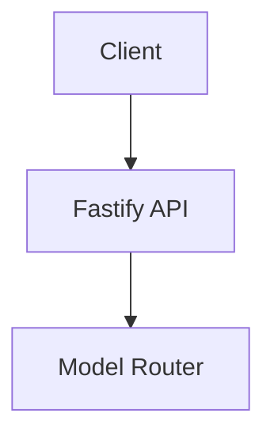
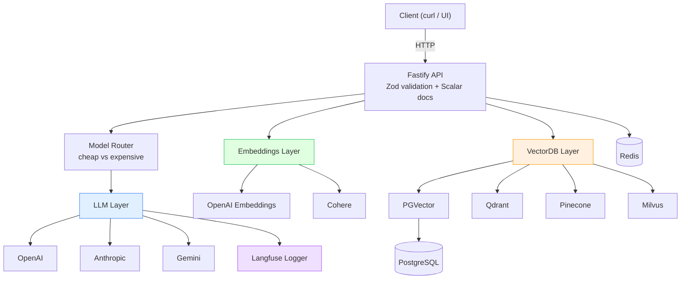
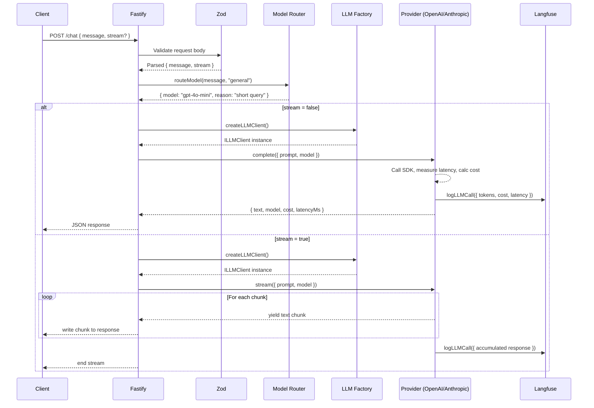
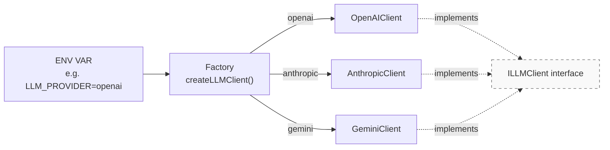
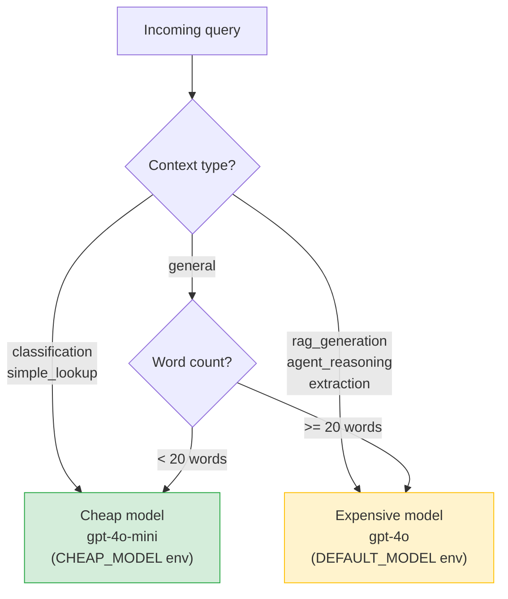
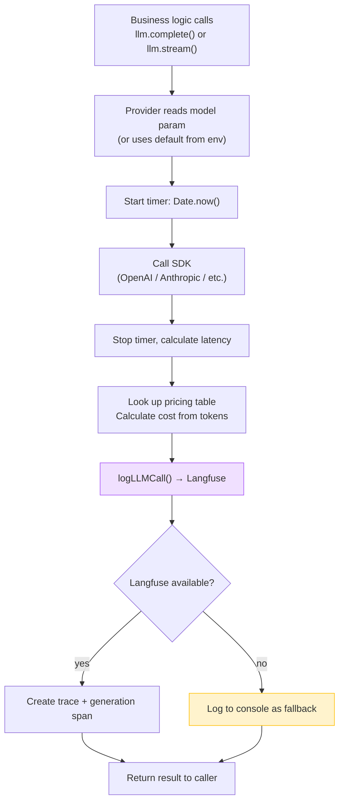
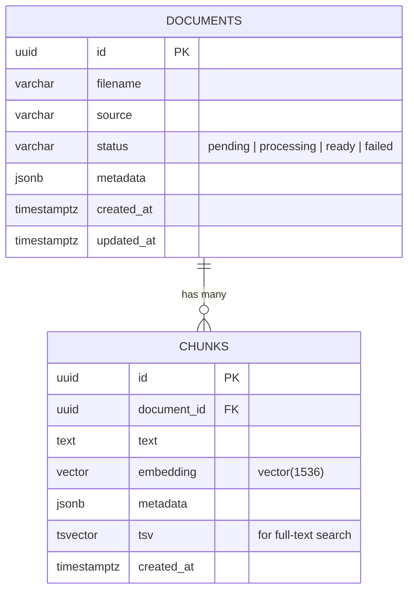
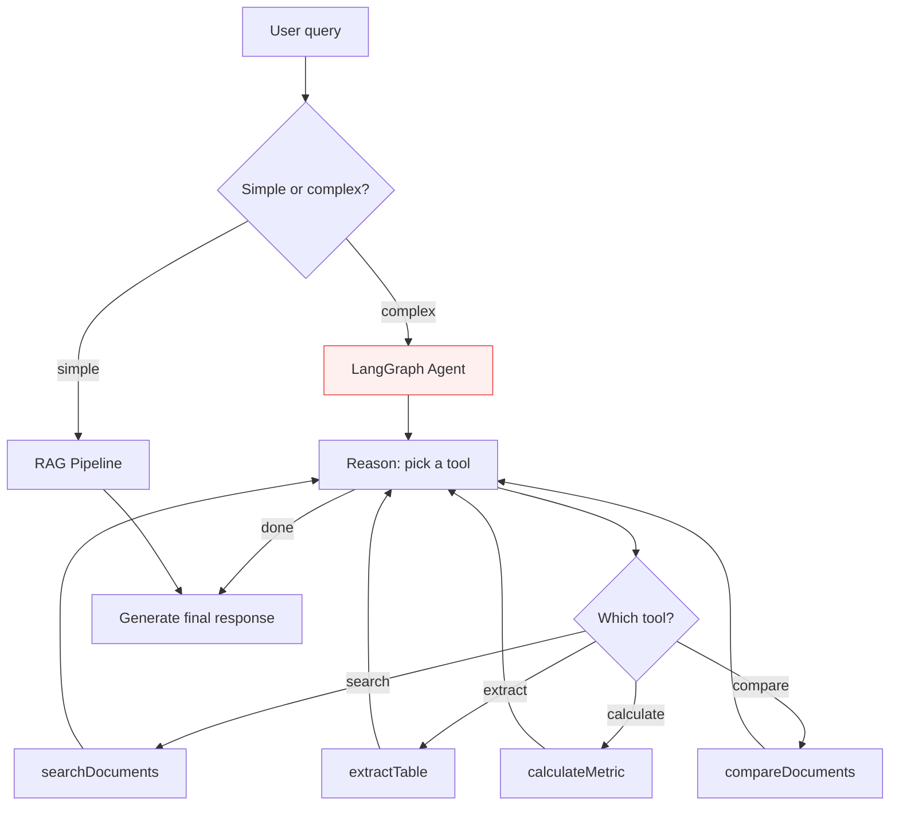

# FinDoc AI — Architecture Guide

A technical walkthrough of how the system works, end to end.

---

## System Overview





> Every external SDK is behind an interface. Business logic never imports `openai` or `@anthropic-ai/sdk` directly.

---

## Request Flow — POST /chat

What happens when a client sends a message:



---

## Provider Factory Pattern

All three abstraction layers use the same pattern. One env var swap changes the entire provider — zero code changes.



```
┌──────────────────────────────────────────────────────┐
│ Same pattern for all three layers:                   │
│                                                      │
│  LLM_PROVIDER       → createLLMClient()    → ILLMClient       │
│  EMBEDDING_PROVIDER  → createEmbeddingClient() → IEmbeddingClient │
│  VECTOR_DB           → createVectorDB()    → IVectorDB        │
└──────────────────────────────────────────────────────┘
```

---

## Model Routing

The router decides cheap vs expensive model **before** the LLM call. This controls cost automatically.



---

## LLM Call Lifecycle

Every LLM call — regardless of provider — follows this exact path:



> Key: the app **never crashes** if Langfuse is down. Observability is best-effort.

---

## Database Schema



**Indexes:**
- `HNSW` on `chunks.embedding` — fast approximate nearest neighbor search
- `GIN` on `chunks.tsv` — full-text search (BM25-style)
- `B-tree` on `chunks.document_id` — document lookups

---

## Planned: RAG Pipeline

How document ingestion and query answering will work:

```mermaid
flowchart TD
    subgraph Ingestion["Document Ingestion (async via BullMQ)"]
        U["PDF upload"] --> EX["Extract text"]
        EX --> CH["Chunk text<br/>(recursive splitting)"]
        CH --> EM["Generate embeddings<br/>via Embeddings Layer"]
        EM --> ST["Store in VectorDB<br/>+ compute tsvector"]
    end

    subgraph Query["Query Pipeline"]
        QU["User question"] --> QE["Generate query embedding"]
        QE --> VS["Vector similarity search"]
        QE --> FS["Full-text search (BM25)"]
        VS --> RRF["Reciprocal Rank Fusion<br/>(merge results)"]
        FS --> RRF
        RRF --> CTX["Build prompt with<br/>retrieved context"]
        CTX --> LLM["LLM generates answer<br/>with citations"]
        LLM --> RES["Return grounded response"]
    end

    style Ingestion fill:#f0f8ff,stroke:#3b82f6
    style Query fill:#f0fff0,stroke:#22c55e
```



---

## Planned: Agent Architecture



---

## File Map — Where Things Live

```
src/
├── api/
│   ├── index.ts              ← Entry point. Env validation, plugin + route registration
│   ├── plugins/cors.ts       ← CORS config
│   ├── plugins/helmet.ts     ← Security headers
│   └── routes/chat.ts        ← POST /chat (Zod schemas → auto OpenAPI docs)
│
├── llm/
│   ├── interface.ts          ← ILLMClient (complete + stream)
│   ├── client.ts             ← Factory: reads LLM_PROVIDER → returns provider
│   └── providers/            ← openai.ts, anthropic.ts, gemini.ts
│
├── embeddings/
│   ├── interface.ts          ← IEmbeddingClient (generate + generateBatch)
│   ├── client.ts             ← Factory: reads EMBEDDING_PROVIDER → returns provider
│   └── providers/            ← openai.ts, cohere.ts
│
├── vectordb/
│   ├── interface.ts          ← IVectorDB (upsert, search, delete, health)
│   ├── client.ts             ← Factory: reads VECTOR_DB → returns adapter
│   └── adapters/             ← pgvector.ts, qdrant.ts, pinecone.ts, milvus.ts
│
├── llmops/
│   ├── logger.ts             ← Langfuse wrapper (called inside every LLM provider)
│   ├── router.ts             ← Cheap vs expensive model routing
│   └── guardrails.ts         ← Placeholder: input/output validation
│
├── rag/index.ts              ← Placeholder: RAG pipeline
├── retrieval/index.ts        ← Placeholder: retrieval strategies
├── agent/index.ts            ← Placeholder: LangGraph agent
└── bank/index.ts             ← Placeholder: bank statement processing

db/migrations/                ← SQL files (auto-run by Docker on first start)
```
